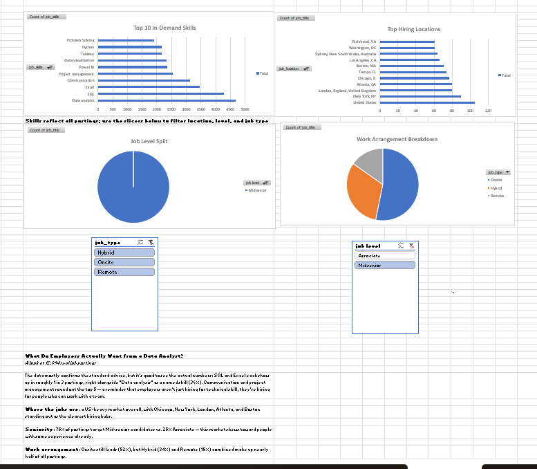

# What Do Employers Actually Want from a Data Analyst?

An Excel-only analysis of 12,894 real data analyst job postings, built to answer a simple question: what do the numbers actually say employers are looking for?

## Overview

- **Dataset:** ~12,900 scraped data analyst job postings (single CSV, 11 columns including job title, company, location, skills, seniority level, and work arrangement)
- **Tools:** Excel — Power Query, PivotTables, PivotCharts, Slicers
- **Goal:** Practice end-to-end Excel analysis (cleaning → pivoting → interactive dashboard) as a complement to my [SQL + Python + Power BI portfolio project](https://github.com/Sarojini-Nayak/olist-ecommerce-analytics)

## Approach

1. **Cleaned and shaped the data in Power Query**, including splitting a multi-value `job_skills` column (comma-separated skills per posting) into one skill per row for accurate frequency counts, and normalizing ~23 pairs of duplicate/inconsistent skill names (e.g. "MS Excel" and "Advanced Excel" → "Excel").
2. **Built a second, un-split query** (one row per posting) to avoid double-counting when analyzing location, seniority, and work arrangement — since the skill-split table has ~18x more rows than actual postings.
3. **Built four PivotTables and PivotCharts**: top in-demand skills, top hiring locations, job level breakdown, and work arrangement breakdown.
4. **Connected slicers** (job level, job type) across the three per-posting charts for interactive filtering.

## Key Findings

- **SQL and Excel** each appear in roughly 1 in 3 postings, right alongside "Data analysis" as a named skill (36%) — the fundamentals still dominate.
- **Communication and project management** round out the top 5 skills — a reminder that employers are hiring for collaboration, not just technical ability.
- **Hiring is US-heavy** overall, with Chicago, New York, London, Atlanta, and Boston as the clearest hubs.
- **75% of postings target Mid-senior candidates** vs. 25% Associate — this market skews toward some prior experience.
- **Onsite still leads (52%)**, but Hybrid (34%) and Remote (15%) combined make up nearly half of all postings.

## A Note on Process

I originally planned a "postings over time" trend chart, but discovered the `first_seen` column had zero date variation — every posting was scraped on the same day, meaning there was no real trend to chart. I swapped it for a work-arrangement breakdown instead. Catching that early and adjusting the plan, rather than forcing a chart the data couldn't support, felt like the most useful part of doing this analysis.

## Files

- `Data_Analyst_Job_Market_Dashboard.xlsx` — the full workbook (Power Query steps, pivot tables, dashboard)
- Screenshots of the dashboard and slicer interactivity (since GitHub's file preview doesn't render pivot table interactivity)

## Connect

- [Portfolio](https://sarojini-nayak.vercel.app/)
- [GitHub](https://github.com/Sarojini-Nayak)
